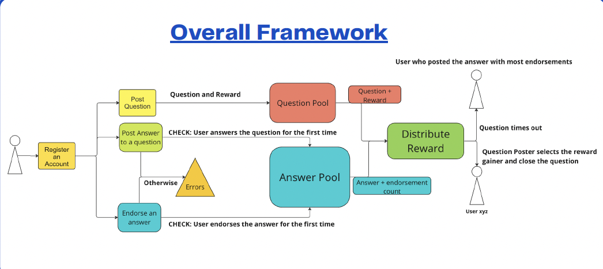

# SmartQ&A
## Overview


SmartQ&A is a blockchain based question and answering platform that allows users to engage in interactive knowledge sharing where they can post question and earn ETH with good answers. In this project, we utilize `solidity 0.8.1` to achieve following features:

- User Registration
- Question Asking
- Answer Posting
- Answer Endorsement
- Adward Distribution


## Team Member
- James Pflaging
- Ray Du
- Allen Hu
- Zixiao Jin


## Framework



## Installation

SmartQ&A requires [Solidity](https://docs.soliditylang.org/en/v0.8.1/) v0.8+ to run.

Clone repository onto local machine `https://github.com/AllenHsm/CS190J-Smart_QA.git`

Run the tests

```sh
forge build
forge test -vvv
```

## License

MIT
