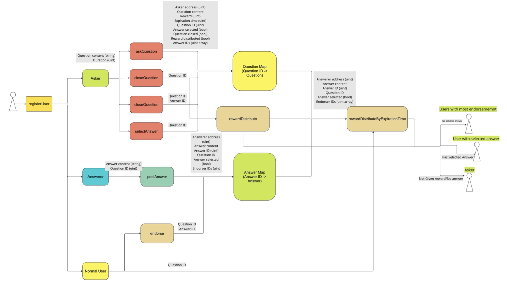

# SmartQ&A
## Overview


SmartQ&A is a blockchain based question and answering platform that allows users to engage in interactive knowledge sharing where they can post question and earn ETH with good answers. In this project, we utilize `solidity 0.8.1` to achieve following features:

- User Registration
- Question Asking
- Answer Posting
- Answer Endorsement
- Adward Distribution


## Team Members
- James Pflaging
- Ray Du
- Allen Hu
- Zixiao Jin


## Framework


## Contracts
- Reward Management
  - Close Question
  - Distribute reward based on question status
  - Lookup endorsement count & best answer selection
- Question Management
  - Ask Question
  - Check if the question is expired
- Answer Management
  - Post answer
  - Endorse other answers
  - Select best answer or cancel previous selection
- User Management
  - Register
  - Calculate user credit
- Queue
  - Dynamically store user's credit history
## Installation

To mock the Contracts, clone and upload the folder to [Remix](remix.ethereum.org). Delete the test folder. Then compile the RewardManagement contract and deploy it using Remix VM (Cancun). All the public functions will show below and you can customize the input and play with them. 

## Run the tests locally

```sh
forge build
forge test -vvv
```
# Introduction
## What users can do
- Ask and answer questions
- Set Ethereum reward for good answers
- Endorse other users' answer
## Ask Question

To ask questions, you first need to register with `registerUser("your_name_string")`. The personal user name can be seen by others. Then put in your question, set expiration time and amount of reward in `askQuestion(question_string, day, hour, minute)`. Make sure the wallet you used to register have enough balance as you need to deposit the reward when the question is posted. But don't worry, if unfortunately, you do not get any satisfactory answers, you are free to close the question and get your money back before the expiration time. We will discuss closing questions in more details later. 

There is a upper bound, `0.01 ether`, for the maximum reward a new user can set. Every time you choose to or not to give out the reward will affect your credit history. The more reward you give out, the higher reward you can set in the future. 

## Quesitoner

If you want to send the reward to a specific answerer, you need to choose it as the best answer using `selectAnswer(question_id, answer_id)` before you close the question. Otherwise, by the time question expires, the reward will be automatically sent to the user whose answer get most endorsement. If the selected answer is no longer the best, you can use `cancelSelection(question_id)` to cancel and select another answer again if you want. 

To close the question, you need to call `closeQuestion(question_id, give_out_reward_or_not)`. This function will first check whether the question is expired. If no, the `closeQuestion` function will automatically call `rewardDistribute(question_id, give_out_reward_or_not)` to send the reward. If `give_out_reward_or_not == true`, indicating that the questioner would like to give out the reward, and the questioner selected a best answer, the answer's author will receive all the reward. If the questioner did not select a best answer, then the reward will be equally divided and sent to the most endorsed answers' authors. If the questioner did not receive a satisfactory answer, which means `give_out_reward_or_not == false`, then the reward will be sent back to the questioner.   

However, if the question expired before the questioner close it, after calling `closeQuestion` you will receive an error. In this case, every user can call `rewardDistributeByExpirationTime(question_id)` to distribute the reward. The reward will be given to selected / most endorsed authors (if no answer selected) unless the question did not get any answer such that money is given back to questioner. 

## Credit System

As we discussed earlier, the default credit of new user is `0.01 Ether`, which is around `$35` in Jun 2024. Once a question is closed, the questioner's credit history will be updated. The credit is dynamically calculated with the latest five questions' reward given by questioner. If the questioner choose not to send the reward, then a `$0` will be recorded.

## Regular User

Every user can view all the questions' information with `getQuestionContent(question_id)`, `getQuestionReward(question_id)`, `getQuestionExpirationTime(question_id)`, `getQuestionCurrentID()`. 

To get answer info, you can call `getAnswerContent(answer_id)`, `getAnswerID(question_id)`, `getNumberOfEndorsements(answer_id)`. 

You can post one and only one answer to each question by calling `postAnswer(q_id, answer_string)` and use `endorse(answer_id, question_id)` to endorse other user's answer only once. 